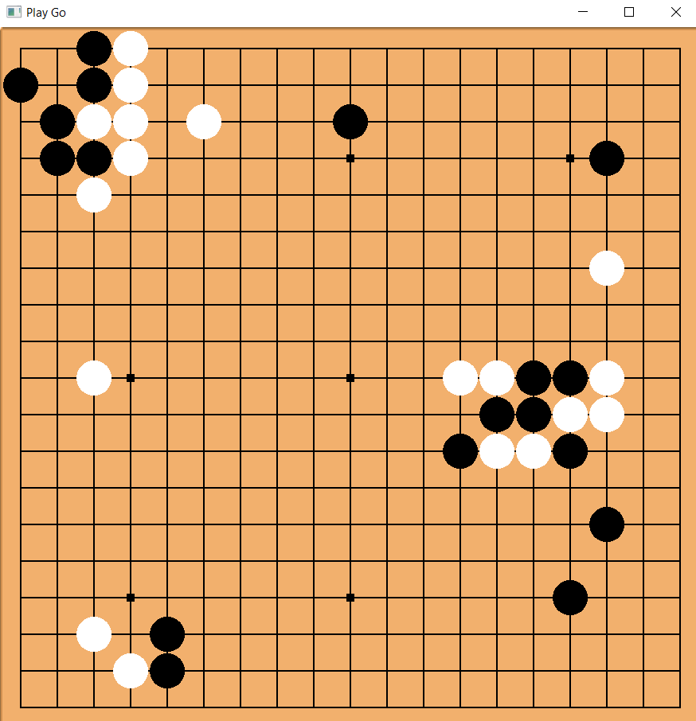

Jeu de Go en multijoueur local, développé en C++ en 2 semaines pendant l'été 2018, avec la bibliothèque graphique SFML.
Le jeu respecte intégralement les règles du jeu (notamment les règles de Ko et les interdictions de mouvements suicidaires).

Le jeu m'a notamment permis de réfléchir à une architecture relations entre le plateau, les pierres et les groupes de pierres de même couleur adjacentes, appelés formations). J'ai aussi travaillé sur l'usage des smart-pointers en C++.
